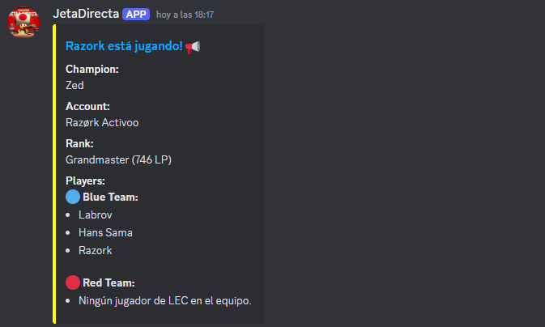

# 🎮 Bot de Discord - JetaDirecta

Este bot fue desarrollado para el streamer de Twitch **Toad Amarillo** (https://www.twitch.tv/toadamarillo). Su función principal es monitorear partidas de jugadores profesionales de League of Legends utilizando la API de Riot Games y enviar alertas automáticas a un canal de Discord mediante la API de Discord.js.

## 📋 Características

- Consulta la API de Riot Games para verificar si un pro player está en partida.
- Publica un mensaje en un canal de Discord con información detallada del jugador:
  - **Nombre del Jugador**
  - **Campeón**
  - **Cuenta**
  - **Rango**
  - **Otros Jugadores**

## 🔧 Tecnologías Utilizadas

- **Lenguaje:** JavaScript (Node.js)
- **APIs:** Riot Games API, Discord.js
- **Bibliotecas Clave:** express, dotenv y discord-interactions

## 🚀 Instalación y Configuración

1. **Clona el Repositorio:**
   ```bash
   git clone https://github.com/tuusuario/lol-proplayer-discord-bot.git
   ```
2. **Instala Dependencias:**
   ```bash
   npm install
   ```
3. **Configura Variables de Entorno:**
   Crea un archivo `.env` con tus claves:
   ```env
   APP_ID=tu_discord_app_id
   DISCORD_TOKEN=tu_discord_token
   PUBLIC_KEY=tu_discord_public_key
   RIOT_TOKEN=tu_clave_de_riot
   CHANNEL_ID=canal_id_discord
   WEBHOOK_URL=webhook_del_canal_(En caso de usar interacciones)
   ```
4. **Ejecuta el Bot:**
   ```bash
   node app.js
   ```

## 📦 Ejemplo de Uso


## 💡 Mejoras Futuras

- Agregar comandos para consultas manuales para añadir funcionalidades.
- Agregar la posibilidad de abrir el espectador del LoL desde discord.
- Manejo avanzado de errores y desconexiones.

## 📜 Licencia y Créditos

Este proyecto está bajo la licencia **MIT**